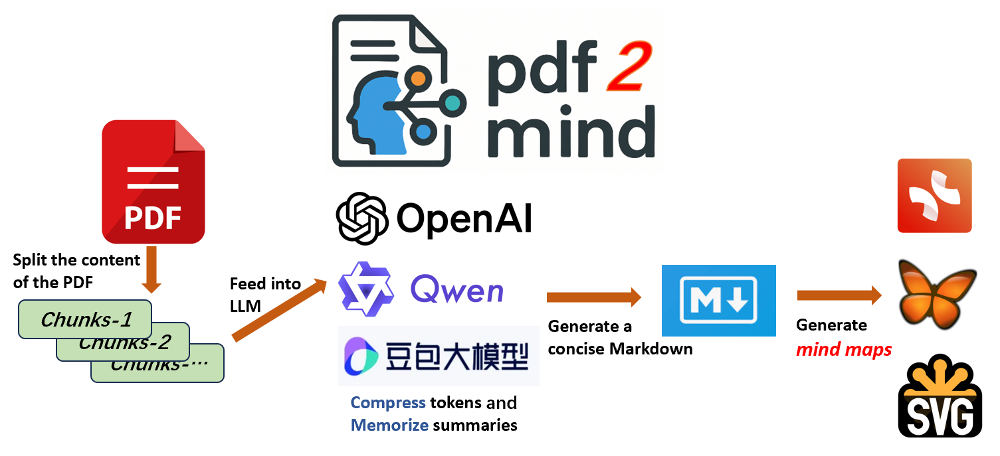

| [中文](README.CN.md) | [English](README.md) |

# pdf2mind

**pdf2mind** is an intelligent tool powered by large language models (LLMs) that automatically converts lengthy PDF documents into well-structured mind maps with a single click. It supports output formats including **XMind**, **FreeMind**, and **SVG**.

# Demo Show

- [Watch the Demo Video](misc/demo-show-vedio.mp4)
- [Result Show](testdata/GreenAI-13Page.pdf_20250413151347.svg)

# Environment Dependencies

This project supports both **Windows** and **Linux** environments. **macOS** has not been tested yet.

To set up the environment, run the following commands:

```bash
conda create --name pdf2mind python=3.12
conda activate pdf2mind
pip install -r requirement.txt -i https://mirrors.tuna.tsinghua.edu.cn/pypi/web/simple
```

Other required dependency:

- [Graphviz](https://graphviz.org/)

# Support

## Supported Models

| Vendor  | Required ENV Variable |
| ------- | --------------------- |
| OpenAI  | `OPENAI_API_KEY`      |
| Qwen    | `DASHSCOPE_API_KEY`   |
| Doubao  | `ARK_API_KEY`         |

## Supported Mind Map Formats

| Software | Format |
| -------- | ------ |
| XMind    | `.md`  |
| FreeMind | `.mm`  |
| SVG      | `.svg` |

## Usage

Here is an example using the **Doubao** large language model:

```bash
$ setx ARK_API_KEY ***key***      # On Windows
$ export ARK_API_KEY=***key***    # On Linux/macOS
$ python main.py --pdf testdata/GreenAI-2page.pdf --language Chinese --use-doubao --model doubao-1-5-lite-32k-250115
```

After successful execution, mind maps in all three supported formats will be generated in the source directory.

# TODO List

- **Highest Priority**
  * Implement asynchronous I/O
  * Design a more comprehensive class structure
  * Add logging functionality
  * Optimize configuration parameters, including: model temperature, PDF chunk/overlap length, maximum depth of mind map, etc.

- **Lower Priority**
  * Switch to `poetry` for dependency management
  * Add Docker support
  * Provide a Flask-based frontend API service
  * Add unit tests using `pytest`
  * Add GitHub workflow automation
  * Support more models and output formats

There’s so much more I’d love to implement. Once these tasks are completed, I plan to revisit foundational knowledge on large language models and Python project best practices.

# Acknowledgments

- I’ve learned a great deal from [yihong0618](https://github.com/yihong0618)’s [xiaogpt](https://github.com/yihong0618/xiaogpt) and [bilingual_book_maker](https://github.com/yihong0618/bilingual_book_maker).
- The project [ChatPaper2Xmind](https://github.com/MasterYip/ChatPaper2Xmind) has also been a great inspiration.
